# JSA — Job Search Assistant

JSA is a CLI-launched local web application that automates tailored job-application document generation. You supply a CSV of job openings and your CV; you launch the rows you want, and for each one a three-stage AI pipeline (**fit assessment → CV adjustment → cover letter**) produces tailored documents that you review in a browser UI — approving the CV before the cover letter is written — request revisions on, and export to PDF/DOCX.

Everything runs locally — a FastAPI backend, a SQLite database, and a React/Vite frontend — driven by whichever AI backend you point it at, from eight supported backends (Claude CLI, Google `agy` CLI, Anthropic REST API, OpenCode Zen, Mistral, OpenRouter, Google Gemini REST API, OpenCode-GO).

<p align="center">
  
</p>

**Features:**

- Three-stage pipeline per job: fit assessment (gate) + CV tailoring + cover letter generation
- Fit-assessment gate: jobs flagged as a poor fit park in an "unfit" modal instead of burning pipeline time — dismiss the job or override and continue
- Up to 5 jobs processed concurrently with automatic semaphore control
- Follow-up Q&A: the AI asks clarifying questions; you answer them in the browser Inbox
- Full crash resilience: every stage is checkpointed; resume exactly where you left off after any crash or restart
- Two-lane pipeline with a CV gate: the tailored CV parks for your approval *before* any cover letter is written, so the letter is always written against the CV you actually approved
- Revision loop: request edits on generated CV or cover letter; new document version written without re-running the whole pipeline. Where the backend supports it, revisions are applied as targeted **patches** to the existing document rather than a full rewrite — see [`docs/TOOLS.md`](docs/TOOLS.md)
- Per-job prompt injection: before launching a job, override the system prompt (prefix and/or postfix) and the first user message for that job alone, and save reusable presets — see [Prompt injection](#prompt-injection-per-job)
- Live agent stream: a REASONING card shows the model's thinking as discrete steps while it works, with executed tool calls inline
- Browser UI with live pipeline progress, PDF document preview, and PDF/DOCX export
- Standalone CV Structure Editor: infer a structured JSON representation of your base CV from a PDF/DOCX, open a `CVDocument` JSON you already have, or start from a blank structure — and edit it directly. This JSON is what `cv_adjust` tailors per job
- Multiple base CVs ("decks"): keep one deck per profile (backend, data, management…), switch between them in the editor's deck rail, and assign a specific deck to an individual job before launch — that deck is what `fit_assessment` and `cv_adjust` actually read
- Multi-language output and UI: one global preference drives the pipeline's output language (CV/cover-letter JSON, clarifying questions, change-log, fit-assessment reasons) *and* the frontend's own chrome, picked from a 20-language catalog
- Eight AI backends: Claude CLI, Google `agy` CLI, Anthropic REST API, OpenCode Zen, Mistral, OpenRouter, Google Gemini REST API, OpenCode-GO — configurable as an ordered fallback chain, each with a runtime-selectable model (no restart) via the header's backend dropdown. A timeout or an unavailable model first tries the next model on the same backend before burning a backend hop
- All data stored locally in SQLite (`~/.jsa/jsa.sqlite`)

---

## Table of contents

- [Architecture](#architecture)
- [Requirements](#requirements)
- [Install](#install)
- [Quick start](#quick-start)
- [CSV format](#csv-format)
- [CLI flags](#cli-flags)
- [Backends](#backends)
- [Workflow](#workflow)
- [CV Structure Editor](#cv-structure-editor)
- [Prompt injection (per job)](#prompt-injection-per-job)
- [Language preference](#language-preference)
- [Prompt customisation](#prompt-customisation)
- [Persistence and re-runs](#persistence-and-re-runs)
- [Development](#development)
- [Project structure](#project-structure)

---

## Architecture

A job moves through the pipeline as a single row in the `jobs` table, driven forward by an **orchestrator** that never blocks the event loop and always checkpoints state and output atomically.

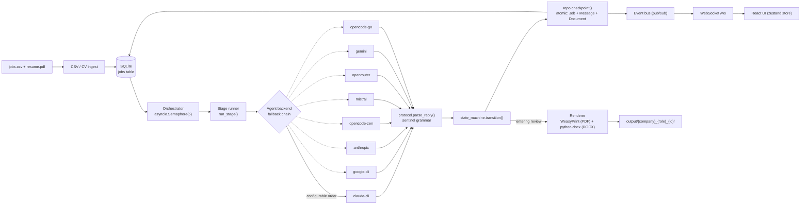

- **Orchestrator** (`jsa/pipeline/orchestrator.py`) polls `list_runnable_jobs()` and dispatches work under an `asyncio.Semaphore(5)`, so at most 5 jobs run concurrently. Every blocking call (WeasyPrint, python-docx, pypdf, CLI subprocesses) is wrapped in `asyncio.to_thread`.
- **Stage runner** (`jsa/pipeline/stages.py`) drives one stage (`fit_assessment`, `cv_adjust`, `cover_letter`, `revising_cv`, `revising_cl`) against an `AgentBackend`, expecting a reply that ends in the sentinel grammar below.
- **Sentinel protocol** (`jsa/agents/protocol.py`) — the CLI backends (`claude-cli`, `google-cli`), any structured-capable backend's downgraded session, and `opencode-go`'s `/messages`-protocol models (sentinel-only always — see below) terminate every reply with exactly one of:
  ```
  <<<NEED_INPUT>>>
  <question to the user>
  <<<END>>>
  ```
  or
  ```
  <<<FINAL>>>
  <final markdown payload>
  <<<END>>>
  ```
  A missing or malformed sentinel raises `ProtocolError` and the job is marked `failed` — this is enforced, not advisory.
- **Structured output** — the structured-capable API backends (`anthropic`, `opencode-zen`, `mistral`, `openrouter`, `gemini`, and `opencode-go`'s `/chat/completions`-protocol models) skip the sentinel grammar and get a provider-enforced JSON object back instead (Anthropic via forced tool-use, everyone else via `response_format`/`responseSchema`), validated against a per-stage Pydantic schema (`jsa/schema/turn_models.py`). Each downgrades to sentinel mode per-session if a reply comes back unparseable; `opencode-go`'s `/messages`-protocol models (e.g. `qwen3.8-max`) never attempt structured mode at all — forced tool-use doesn't take on that gateway path. The database always stores the same normalized canonical text either way, so mixing modes across a BF-19 backend switch or a resumed session is transparent to the rest of the pipeline.
- **State machine** (`jsa/pipeline/state_machine.py`) is the single source of truth for legal transitions; `Job.state` and `Job.current_stage` are never set directly.
- **Checkpointing** — every state-changing write goes through `repo.checkpoint()`, a single atomic transaction that writes the new `Job` state, any `Message` rows, and any `Document` row together. This is what makes crash recovery lossless.
- **Tool loop** (`jsa/pipeline/tool_loop.py`) — a revision may patch the existing document through a bounded set of tools instead of re-emitting it. Three rungs, tried in order: provider-native tool calling, a prompt-described contract for backends without it, and a full-document rewrite as the permanent floor. `docs/TOOLS.md` is the reference for the tools, error codes and rung matrix, and a test fails if that doc drifts from the code.
- **Rendering** happens when a job *enters* a parked state — `cv_review` (CV only, on `cv_adjust` completion or a CV revision) and `review` (both documents) — not on approve. `approve` only flips the state; re-export is available on demand afterward.

### Job state machine

The diagram below shows the primary happy-path route through `JobState`; `failed`/`dismissed` are reachable from nearly every state (see the full transition table in `jsa/pipeline/state_machine.py`).

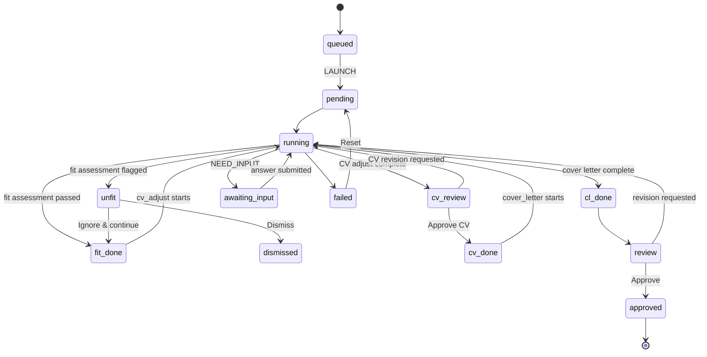

Two things in that diagram are easy to miss and matter in practice:

- **`queued` is where every job starts.** CSV ingest parks a job; nothing is dispatched until you press **LAUNCH** on the row (or **LAUNCH ALL**). This is also the only window in which a job's base CV and [prompt injection](#prompt-injection-per-job) can be set — both are frozen once the job leaves `queued`.
- **`cv_review` is a real park, not a pass-through.** The pipeline runs as two sequential lanes — CV, then cover letter — with a gate between them. A finished `cv_adjust` lands in `cv_review` and stays there: you approve the tailored CV or ask for a revision, and only an approval opens the cover-letter lane. The cover letter is then written against the CV you actually approved, not against the base deck.

### Backend fallback chain

Backends implement a common `AgentBackend` ABC (`jsa/agents/base.py`) and are tried in order via `--backends claude-cli,google-cli,anthropic,opencode-zen,mistral,openrouter,gemini,opencode-go` (or the equivalent `JSA_BACKENDS` env var, any subset/order). On a hard failure (rate limit, session expiry) the orchestrator fails over to the next backend in the chain and resumes the job from its last checkpoint — the UI surfaces which backend is currently active, and clicking a backend row opens a submenu to pick that backend's model at runtime (no restart):

<p align="center">
  
</p>

**Model ladder — tried before the backend hop.** A timeout or an "unavailable" failure (a bad
model, an auth error, an upstream overload that already spent its own retries) first tries the
**next model on the same backend**, walking a cost-ordered ladder from whatever you selected in
the dropdown. Only when that is exhausted does the job move to the next backend in the chain. A
rate-limit or quota signal skips the ladder entirely and hops backends immediately — a different
model on the *same* account does nothing for an exhausted account. Two brakes keep this from
re-asking your clarifying questions in a loop: at most 5 model hops per job, and once you have
answered a follow-up, at most one further hop. The job row shows the model it is actually running,
and a chain-exhaustion message names how many models were tried.

### API surface

| Area | Routes |
|------|--------|
| Jobs | `GET /api/jobs`, `GET /api/jobs/{id}`, `GET /api/jobs/{id}/transcript`, `POST /api/jobs/{id}/launch`, `POST /api/jobs/launch-all`, `POST /api/jobs/{id}/answer`, `POST /api/jobs/{id}/approve-cv`, `POST /api/jobs/{id}/approve`, `POST /api/jobs/{id}/revise`, `POST /api/jobs/{id}/dismiss`, `POST /api/jobs/{id}/ignore-fit`, `POST /api/jobs/{id}/cancel`, `DELETE /api/jobs/{id}`, `POST /api/jobs/{id}/reset`, `GET /api/jobs/{id}/document/{stage}`, `POST /api/jobs/{id}/export` |
| Files | `GET /api/files/{relpath}` — serves rendered PDF/DOCX with `Content-Disposition: inline` |
| CV Structure Editor | `GET /api/cv-structure`, `PUT /api/cv-structure` (both aliases for the default deck), `POST /api/cv-structure/infer` |
| Base CVs (decks) | `GET /api/cv-decks`, `POST /api/cv-decks`, `GET /api/cv-decks/{id}`, `PUT /api/cv-decks/{id}`, `PATCH /api/cv-decks/{id}` (rename / set default), `POST /api/cv-decks/{id}/duplicate`, `DELETE /api/cv-decks/{id}`, `PUT /api/jobs/{id}/base-cv` (assign a deck to a job; pre-launch only) |
| Prompt injection | `PUT /api/jobs/{id}/injection` (pre-launch only — `400` once the job leaves `queued`), `GET /api/injection-presets`, `PUT /api/injection-presets` (the saved-dose library, whole-list replace) |
| Model selection | `GET /api/backend-models` (current selections, no network), `GET /api/backend-models/{backend}` (live listing, catalog fallback — a provider fetch failure is a `200`, never a `500`), `PUT /api/backend-models` |
| Preferences | `GET /api/preferences`, `PUT /api/preferences` — global output/UI language, `{"language": "es"}` |
| Meta | `GET /api/health`, `GET /api/config` |
| Realtime | `WS /ws` — pushes `status_changed`, `stage_complete`, `follow_up_needed`, `approved`, `job_removed`, `log`, `error`, `backend_switched`, `model_switched`, `transcript_changed`, `infer_progress`, and the live agent stream (`agent_chunk` for content/reasoning tokens, `agent_tool` per executed tool call, `agent_turn_end`) to the React store |

---

## Requirements

- **Python 3.11+**
- **Node.js 18+** (only needed once to build the frontend bundle)
- **System libraries for WeasyPrint:**
  - macOS: `brew install cairo pango gdk-pixbuf libffi`
  - Linux (Debian/Ubuntu): `apt install libcairo2 libpango-1.0-0 libgdk-pixbuf2.0-0 libffi-dev`

---

## Install

```bash
# Clone the repository
git clone https://github.com/yourname/jsa.git
cd jsa

# Install the Python package (editable install includes all dependencies)
pip install -e .

# Build the frontend bundle (required once; re-run after any frontend changes)
cd frontend && npm install && npm run build && cd ..
```

---

## Quick start

```bash
jsa --csv jobs.csv --cv resume.pdf
```

This opens `http://localhost:8765` in your browser, ingests the CSV rows as jobs, and begins processing them in the background. Pipeline progress updates live in the UI.

---

## CSV format

The CSV file must have exactly these five columns (order matters):

| Column    | Description                                      |
|-----------|--------------------------------------------------|
| `company` | Company name                                     |
| `role`    | Role / job title                                 |
| `link`    | URL to the job posting                           |
| `tier`    | Priority tier: `A` (high), `B` (medium), `C` (low) |
| `JD`      | Full job description text (may be multi-line)    |

**Example:**

```csv
company,role,link,tier,JD
Acme Corp,Software Engineer,https://acme.com/jobs/1,A,"We are looking for a software engineer to join our platform team. You will work on distributed systems..."
Beta Inc,Product Manager,https://beta.io/careers/pm,B,"Seeking a PM with 3+ years experience in B2B SaaS. Responsibilities include..."
```

Multi-line job descriptions must be wrapped in double quotes (standard CSV quoting). Most spreadsheet exports handle this automatically.

---

## CLI flags

| Flag | Default | Environment variable | Description |
|------|---------|----------------------|-------------|
| `--csv` | required | — | Path to the jobs CSV file |
| `--cv` | optional | — | Path to a CV (`.pdf` or `.docx`) — used **once**, to seed your **first base CV deck** if none exists yet. Ignored (with a printed note) once any deck has a CV. The editor is the source of truth from then on — see [CV Structure Editor](#cv-structure-editor) |
| `--out` | `output/` | `JSA_OUTPUT_DIR` | Directory where rendered PDF/DOCX files are written |
| `--backend` | `claude-cli` | `JSA_BACKEND` | AI backend (single), backward-compat alias for `--backends`: `claude-cli` \| `google-cli` \| `anthropic` \| `opencode-zen` \| `mistral` \| `openrouter` \| `gemini` \| `opencode-go` |
| `--backends` | `claude-cli` | `JSA_BACKENDS` | Comma-separated ordered backend fallback chain, e.g. `claude-cli,google-cli,mistral` |
| `--db` | `~/.jsa/jsa.sqlite` | `JSA_DB_PATH` | SQLite database path |
| `--port` | `8765` | `JSA_PORT` | Port for the local web server |
| `--no-browser` | false | — | Skip opening the browser automatically |
| `--select-language` | false | — | Show a full-screen language picker + boot sequence before the dashboard on launch — see [Language preference](#language-preference) |
| `--fit-model` | none | `JSA_FIT_MODEL` | Model for the fit-assessment stage only (e.g. a cheaper/faster one). Defaults to the same model as every other stage. No effect on `google-cli`, which has no model flag |
| `--fit-timeout` | none | `JSA_FIT_TIMEOUT` | Per-reply timeout in seconds for the fit-assessment stage only. Defaults to the backend's normal timeout |
| `--prompt-caching` / `--no-prompt-caching` | on | `JSA_PROMPT_CACHING` | Send provider prompt-caching request fields (`anthropic`, `mistral`, `openrouter`, `gemini`, `opencode-go`). Off makes every payload byte-identical to the pre-caching shape — a kill switch, not a tuning knob |
| `--dev-tunnel` | false | — | Start a `cloudflared` quick tunnel for remote/phone access. **Exposes the unauthenticated API publicly — dev use only** |
| `--dev-auto` | false | — | Dev-only: auto-answer `NEED_INPUT` gates from a `DEV_ANSWERS.json` pattern file instead of waiting for you |

---

## Backends

### `claude-cli` (default)

Uses the `claude` CLI tool as a subprocess. Requires `claude` to be installed and authenticated.

Download and authenticate: [https://claude.ai/download](https://claude.ai/download)

```bash
jsa --csv jobs.csv --cv resume.pdf --backend claude-cli
```

### `google-cli`

Uses the `agy` (Google Antigravity) CLI tool as a subprocess. Requires `agy` to be installed and authenticated.

```bash
jsa --csv jobs.csv --cv resume.pdf --backend google-cli
```

### `anthropic`

Uses the Anthropic REST API directly. Requires the `ANTHROPIC_API_KEY` environment variable to be set.

```bash
export ANTHROPIC_API_KEY=sk-ant-...
jsa --csv jobs.csv --cv resume.pdf --backend anthropic
```

### `opencode-zen`

Uses the [OpenCode Zen](https://opencode.ai/zen) OpenAI-compatible chat-completions API — a single endpoint proxying many models (Claude, GPT, Gemini, and various free-tier models). Requires the `OPENCODE_API_KEY` environment variable to be set.

```bash
export OPENCODE_API_KEY=...
jsa --csv jobs.csv --cv resume.pdf --backend opencode-zen
```

The default model is the free `nemotron-3-ultra-free` — note this model is observably flaky under upstream load (intermittent errors from the underlying provider); pair it with a fallback chain (`--backends opencode-zen,claude-cli`) for reliability, or set `JSA_OPENCODE_ZEN_MODEL` to a paid model.

Optional environment variables for this backend:

| Variable | Default | Description |
|----------|---------|-------------|
| `JSA_OPENCODE_ZEN_MODEL` | `nemotron-3-ultra-free` | Model ID from OpenCode Zen's catalog |
| `JSA_OPENCODE_ZEN_TIMEOUT` | `180` | Per-request timeout in seconds |

Optional environment variables for the `anthropic` backend:

| Variable | Default | Description |
|----------|---------|-------------|
| `JSA_MODEL` | `claude-haiku-4-5` | Model name to use (also applies to `claude-cli`) |
| `JSA_ANTHROPIC_TIMEOUT` | `180` | Per-request timeout in seconds |
| `JSA_AGENT_TIMEOUT` | `600` | Per-request timeout for CLI backends (`claude-cli`, `google-cli`) |
| `JSA_FIT_MODEL` | none | Model for the fit-assessment stage only; see [CLI flags](#cli-flags) |
| `JSA_FIT_TIMEOUT` | none | Per-reply timeout for the fit-assessment stage only; see [CLI flags](#cli-flags) |

### `mistral`

Uses the Mistral chat-completions API directly. Requires the `MISTRAL_API_KEY` environment variable.

```bash
export MISTRAL_API_KEY=...
jsa --csv jobs.csv --cv resume.pdf --backend mistral
```

### `openrouter`

Uses [OpenRouter](https://openrouter.ai)'s OpenAI-compatible chat-completions API — itself a multi-provider aggregator, so it widens the fallback chain's provider diversity per backend more than any other entry here. Requires the `OPENROUTER_API_KEY` environment variable. Model IDs are namespaced (`vendor/model`, e.g. `nvidia/nemotron-3-nano-30b-a3b`).

```bash
export OPENROUTER_API_KEY=...
jsa --csv jobs.csv --cv resume.pdf --backend openrouter
```

### `gemini`

Uses Google's native Gemini `generateContent` REST API directly (not the `agy` CLI `google-cli` uses, and not an OpenAI-compat shim). Requires `GEMINI_API_KEY` (or `GOOGLE_API_KEY` as a fallback).

```bash
export GEMINI_API_KEY=...
jsa --csv jobs.csv --cv resume.pdf --backend gemini
```

### `opencode-go`

Uses [OpenCode Zen's Go tier](https://opencode.ai/docs/en/go/) — a separate model catalog from `opencode-zen`, spanning two wire protocols per model (most are OpenAI-compatible `/chat/completions`; a few premium models are Anthropic-shape `/messages` and run sentinel-only, without structured output). Requires `OPENCODE_GO_API_KEY` (or `OPENCODE_API_KEY` as a fallback — distinct from the `opencode-zen` backend's own key usage).

```bash
export OPENCODE_GO_API_KEY=...
jsa --csv jobs.csv --cv resume.pdf --backend opencode-go
```

New backends register in `jsa/agents/registry.py` by adding an entry to `_REGISTRY`, keyed by the CLI-flag string, and subclassing `AgentBackend`.

---

## Workflow

1. **Start JSA.** Run `jsa --csv jobs.csv --cv resume.pdf` (first run — seeds your CV structure) or just `jsa --csv jobs.csv` on subsequent runs. The browser opens at `http://localhost:8765`.

2. **Launch the jobs you want.** Ingested rows park in `queued` — nothing is sent to a model until you press **LAUNCH** on a row (or **LAUNCH ALL**). While a job is queued, and only while it is queued, you can:
   - pick which [base CV deck](#cv-structure-editor) it runs against, from the doc icon on its row;
   - give it a [prompt injection](#prompt-injection-per-job) of its own, from the syringe icon.

   <p align="center">
     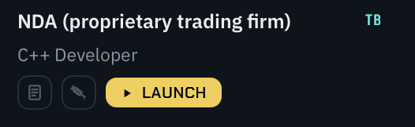
   </p>

   Both are frozen at launch, so a running job's inputs can never change under it.

3. **Pipeline runs in background.** For each launched job, the AI runs up to three stages:
   - *Fit assessment* — a one-shot gate that judges whether the role is a good fit before spending pipeline time on it
   - *CV adjustment* — tailors your CV for the specific role and JD
   - *Cover letter* — writes a matching cover letter

   While a stage runs, the REASONING card streams the model's thinking as discrete steps, with any tool calls it makes listed inline. A long trace windows to the most recent steps behind a "+N earlier steps" toggle, so the card never inflates into a wall:

   <p align="center">
     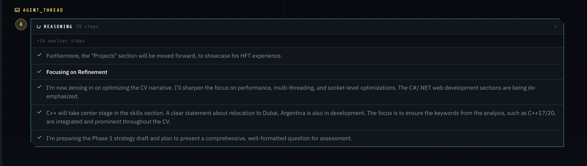
   </p>

   A silent card usually means the selected model simply doesn't emit reasoning — check the model shown on the job row before suspecting the wiring.

4. **Handle an "unfit" verdict (if raised).** If the fit-assessment stage flags the job as a poor match, it parks with the model's reason and a centered `FIT_ASSESSMENT: MISMATCH` modal appears instead of proceeding. Click **Dismiss Job** to drop it, or **Ignore & Continue** to override the assessment and resume the pipeline:

   <p align="center">
     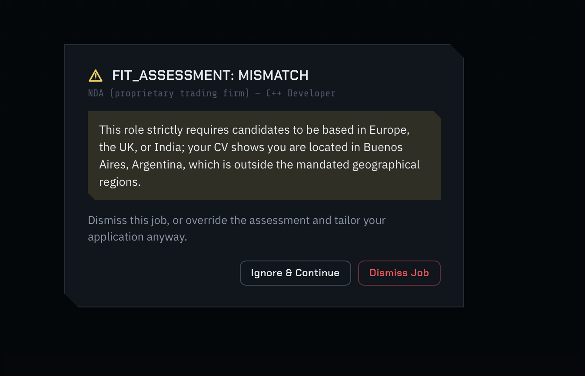
   </p>

5. **Answer follow-up questions.** If the AI needs clarification (e.g., "Your resume lists 'led a team' but doesn't specify team size — can you clarify?"), the job parks in `awaiting_input` and the question appears against that job, blocking further progress until you answer:

   <p align="center">
     
   </p>

   Type your answer and submit; the job resumes automatically.

6. **Approve the tailored CV.** When `cv_adjust` finishes, the job parks at **CV review** with the tailored CV already rendered to PDF/DOCX — the cover-letter lane does not start yet. Approve it, or send a revision instruction and approve the next version. The letter is then written against the CV you approved, so it never describes a document you rejected.

7. **Review both documents.** Once the cover letter completes, the job moves to **Review** and both documents are rendered automatically. Click the job in the left rail to open them side-by-side as PDF previews (see the hero screenshot at the top of this README).

8. **Request revisions (optional).** In either review pane, use the revision chat box to send targeted instructions (e.g., "Make the skills section shorter"). The AI revises that one document without re-running the pipeline; a new version is written and re-rendered. On backends that support it the model *patches* the existing document through a bounded tool loop rather than re-emitting it whole — which keeps the untouched sections byte-identical instead of quietly re-worded. Backends that resume a conversation by id (`claude-cli`, `google-cli`) skip the loop and take the full-rewrite path, which is the same behaviour as before this existed. See [`docs/TOOLS.md`](docs/TOOLS.md) for the tool set and the rung matrix.

9. **Approve.** When satisfied, click **Approve & Export**. This only transitions the job to `approved` — the PDF/DOCX files were already rendered when the job entered Review, at:
   - `{output_dir}/{company}_{role}_{job_id[:8]}/cv.{pdf,docx}`
   - `{output_dir}/{company}_{role}_{job_id[:8]}/cover_letter.{pdf,docx}`

10. **Re-export on demand (optional).** From `review` or `approved`, you can re-render either format at any time (e.g., after editing the base CV) without re-running the pipeline.

11. **Files are in `output/`** (or the path you set with `--out`). The job moves to **Done**.

---

## CV Structure Editor

Separate from the per-job pipeline, JSA maintains job-less **base CVs** as structured JSON (`CVDocument`, `jsa/schema/cv.py`) — these are the **single source of truth** for CV content: both `fit_assessment` and `cv_adjust` read one of them, and nothing else feeds them CV text. You edit them at `/api/cv-decks` (`jsa/store/cv_decks.py`, `jsa/api/routes_cv_decks.py`), either by hand-building or by running inference against an uploaded PDF/DOCX resume. `--cv` on the command line only seeds your first deck, on first run — see [CLI flags](#cli-flags).

**Many base CVs, one per profile.** A hover-out rail on the left of the editor lists every deck; each is independently editable and persists to its own file under `~/.jsa/cv_decks/`. From the rail you can switch, rename, duplicate, delete, star one as the **default**, or start a new one. One deck is always the default — it is what any job that hasn't been given a specific deck will use.

<p align="center">
  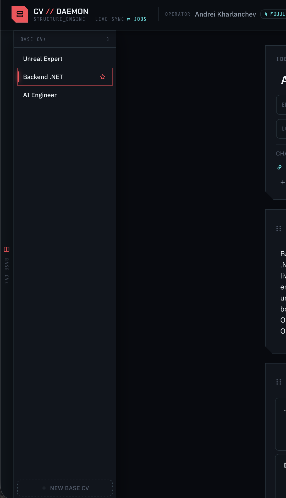
</p>

**Per-job assignment.** Before you launch a job, the doc icon on its row opens a picker listing every deck that has a CV saved; the one you choose is exactly what gets injected into that job's `fit_assessment` and `cv_adjust` prompts. Assignment is **pre-launch only** (`PUT /api/jobs/{id}/base-cv` returns `409` afterwards), and the job's deck is re-resolved at every stage — so editing a deck mid-run feeds the newer content into later stages. A deck that a job is still working with **cannot be deleted** — the rail greys out its trash icon and says how many jobs hold it, and the API answers `409`. Approving, dismissing or deleting those jobs releases it. Editing a held deck is always allowed: a job that has already started has its CV baked into its conversation, so edits can't disturb it mid-flight. Deleting an unheld deck clears the assignment on jobs that were never launched.

<p align="center">
  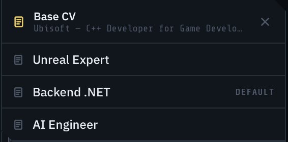
</p>

**Upgrading from a single `cv_structure.json`.** The first time JSA starts after this change, an existing `~/.jsa/cv_structure.json` is **copied** into a deck and becomes your default. The original file is never deleted or rewritten — it stays on disk as an inert backup.

**Jobs stay pending until some deck has a CV.** If you start JSA without `--cv` and never open the editor, launched jobs sit in `pending` — the dashboard shows a banner pointing at the editor. Saving a deck (inferred or hand-built) unblocks them immediately, no restart needed.

**Three ways in.** A deck with nothing in it yet offers all three, side by side:

| | What it does |
|---|---|
| **RUN INFERENCE** | Uploads a PDF/DOCX/TXT/MD resume and runs one-shot inference against it, streaming progress as each step activates |
| **OPEN .JSON** | Reads a `CVDocument` JSON you already have — an export from another deck, a hand-written file, a backup — and loads it verbatim into the editor |
| **INIT BLANK** | Starts from an empty skeleton and you fill it in |

All three fill the editor's buffer and nothing more: **COMMIT** is what writes to disk, so you see the document rendered before it lands, and a file the schema rejects never creates a deck. To build a *new* deck from a JSON file, add a deck in the rail first, then open the file into that empty slot. An imported file that isn't valid JSON, or is valid JSON but isn't a CV structure, says so inline and leaves the editor untouched; anything the `CVDocument` schema objects to is reported by the server on COMMIT, in its own words.

Before anything is saved, the editor shows that empty state:

<p align="center">
  
</p>

<sub>This shot predates **OPEN .JSON** and the BASE CVs rail — the live empty state offers all three entry points side by side.</sub>

Once a structure exists (inferred or hand-built), three synchronized views edit the same JSON — **Blocks** (structured, modular editing), **Document** (read-only export preview), and **Split** (Blocks alongside the raw, schema-valid `src.json`, which is ground truth: every edit writes straight through it):

<table>
<tr>
<td width="33%"><p align="center"><sub>Blocks</sub></p></td>
<td width="33%"><p align="center"><sub>Document</sub></p></td>
<td width="33%"><p align="center"><sub>Split + src.json</sub></p></td>
</tr>
</table>

`PUT /api/cv-decks/{id}` (and its single-deck alias `PUT /api/cv-structure`) validates against the `CVDocument` schema's hard gates (a contact name, at least one renderable section, and a check that the content isn't actually a cover letter) and returns `422` with a concise reason on failure. `POST /api/cv-structure/infer` runs one-shot inference against an uploaded file, broadcasting `infer_progress` events over the WebSocket as each step activates, and returns the result **unsaved** — the editor persists it via `PUT` when you click Done.

---

## Prompt injection (per job)

Sometimes one job needs something the shared prompt shouldn't carry — "this posting is in
German, but write the CV in English", "emphasise the embedded-systems work", "the recruiter
already knows me, skip the introduction". The syringe icon on a **queued** job row opens a vial
panel with three boxes, all optional:

<p align="center">
  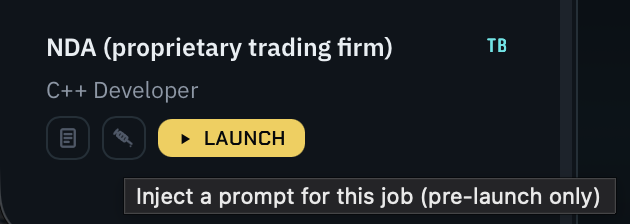
</p>

<p align="center">
  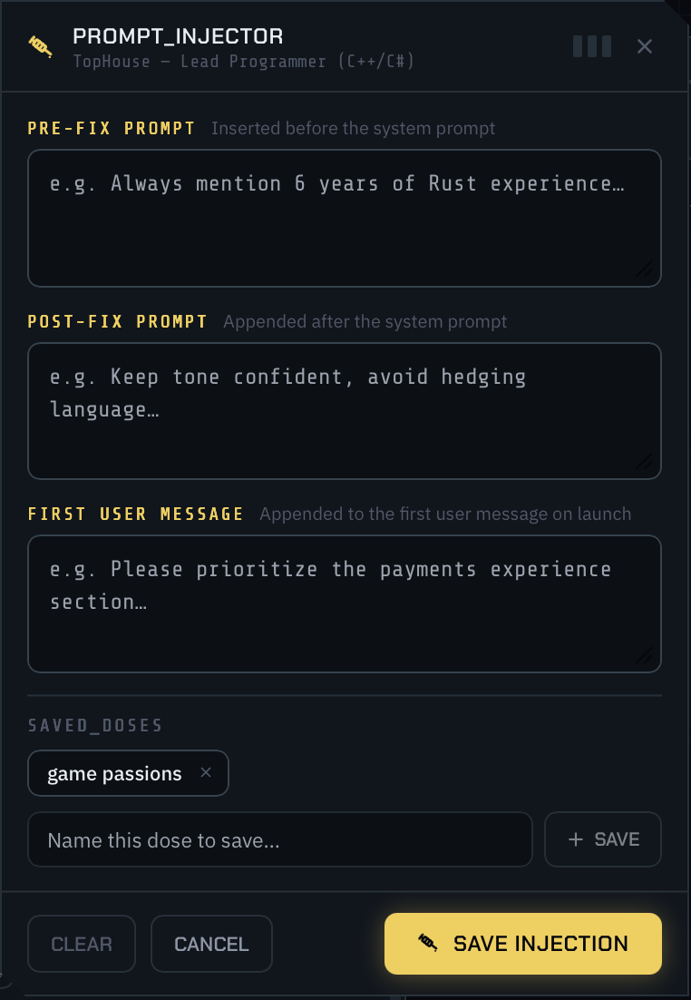
</p>

| Field | Where it lands |
|---|---|
| **PRE-FIX PROMPT** | Prepended to the system prompt for this job |
| **POST-FIX PROMPT** | Appended to the system prompt, *before* the machine-authored sections |
| **FIRST USER MESSAGE** | Appended to the job's opening user message, under an `ADDITIONAL INSTRUCTIONS FROM THE USER` header |

**Pre-launch only.** The panel is only reachable while the job is `queued`, and the server
enforces it — `PUT /api/jobs/{id}/injection` answers `400` once the job has left that state. The
injection is frozen at launch, so a running job's prompt can never shift under it mid-flight.

**Saved doses.** A dose is a named prefix/postfix/first-message triple saved to a global library
you can re-apply to any later job. Name what's in the three boxes and press **+ SAVE**, and it
becomes a chip you can click into any future job's panel. The library lives server-side
(`~/.jsa/injection_presets.json`) and is shared across jobs, not per-job.

<p align="center">
  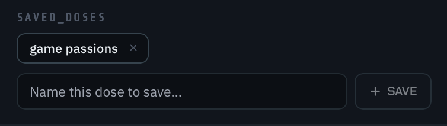
</p>

Three details worth knowing:

- **The machine sections always win.** The structured-output contract and the current-date
  directive are composed *after* your postfix, so a job's injection can reshape the instructions
  but can't override the schema the reply is validated against.
- **The fit gate gets your system wrapper but not your first message.** The fit stage is a
  one-shot `FIT`/`UNFIT` pre-check parsed by its first line, and it fails *closed* to the "not a
  fit" modal — letting free-form instructions into its user message would risk parking a good job
  as unfit over a formatting accident.
- **An injected job forfeits the cross-job prompt cache**, by design: it can't share the prefix
  every uninjected job sends. Its own turns still cache against each other, and uninjected jobs
  are completely unaffected — including an all-blank injection, which is stored as no injection
  at all precisely so a stray space costs you nothing.

---

## Language preference

A single global setting drives both the pipeline's output language and the frontend's UI
chrome — there's no separate "app language" vs. "CV language" toggle. Switch it any time from
the globe pill in the CV Structure Editor's top bar, which opens a searchable dropdown over a
20-language catalog (English, Spanish, French, German, Portuguese, Italian, Dutch, Swedish,
Polish, Russian, Turkish, Arabic, Hebrew, Hindi, Chinese, Japanese, Korean, Vietnamese, Thai,
Indonesian):

<p align="center">
  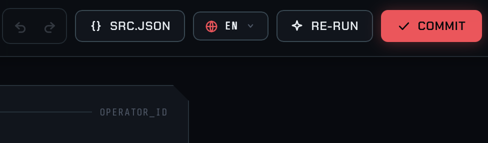
</p>

- **Pipeline output** — the CV/cover-letter JSON, the AI's clarifying questions, its
  change-log, and the fit-assessment reason text are all generated in the selected language.
  Only the `<<<FINAL>>>`/`<<<NEED_INPUT>>>`/`<<<END>>>` sentinels and the literal `FIT`/`UNFIT`
  verdict word stay English/ASCII, since the pipeline parser matches on them.
- **UI chrome** — every frontend string is looked up through the same preference, with an
  English fallback for anything not yet translated.
- The preference is stored server-side (`GET`/`PUT /api/preferences`) and takes effect on the
  **next** new pipeline session — a job whose session is already underway keeps the language it
  started with, so a change mid-run doesn't contradict the conversation history.

Changing the language does not require any local translation work — the UI locale catalogs
ship pre-generated. Maintainers adding new UI strings should see [Development](#development).

### Boot sequence (`--select-language`)

Launch with `--select-language` to force a full-screen language picker in front of the
dashboard, useful for a first-time or shared-machine setup where you want to pick a language
before anything else loads:

```bash
jsa --csv jobs.csv --select-language
```

This mounts a full-viewport overlay (`frontend/src/components/BootGate.tsx`) with two stages:
a language picker, then an animated HUD-style boot log that applies the choice and counts up to
100% before revealing the already-mounted dashboard underneath. It's purely a frontend
presentation layer over the same `PUT /api/preferences` call the globe pill makes — no separate
backend state.

<p align="center">
  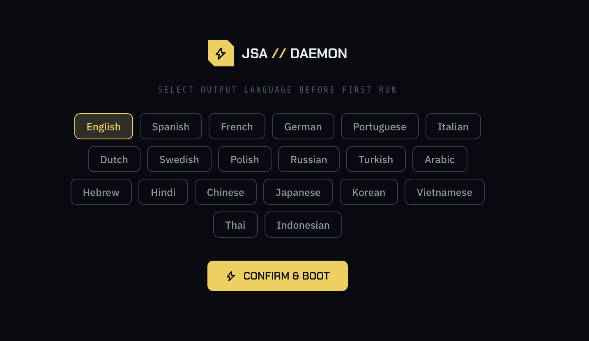
</p>

---

## Prompt customisation

The AI prompts live at:

```
jsa/prompts/PROMPT_FIT_ASSESSMENT.md  # Fit-assessment gate system prompt
jsa/prompts/PROMPT_CDADJUST.md        # CV adjustment system prompt
jsa/prompts/CVL_PROMPT.md             # Cover letter system prompt
```

Edit these files in any text editor. Changes take effect immediately on the next job run (prompts are read from disk on every invocation, never cached).

**MANDATORY: sentinel format.** Every prompt MUST instruct the model to terminate every reply with exactly one of these two blocks:

```
<<<NEED_INPUT>>>
<question to the user>
<<<END>>>
```

or

```
<<<FINAL>>>
<final markdown payload>
<<<END>>>
```

**Do not remove or modify the sentinel instructions in the prompts.** The pipeline parser (`jsa/agents/protocol.py`) will raise a `ProtocolError` and mark the job `failed` if the sentinel is absent or malformed. The sentinel instructions are already present in the default prompt stubs.

**Fit-assessment prompt is a special case.** It must always reply with `<<<FINAL>>>` (never `<<<NEED_INPUT>>>`), and the first line of the payload must be exactly `FIT` or `UNFIT` — anything else (including an unparseable verdict) is treated as `UNFIT` and parks the job behind the "not a fit" modal rather than silently continuing.

---

## Persistence and re-runs

**Database location:** `~/.jsa/jsa.sqlite` (configurable via `--db`).

**Job identity:** `sha1(f"{company}|{role}|{link}")[:16]`. **JD hash:** `sha1(jd)[:16]`.

**Re-running with the same CSV** resumes from the last checkpoint — no work is repeated:

- Jobs in `approved` state with unchanged JD are skipped entirely.
- Jobs in `failed` state are reset to `pending` and restarted.
- Jobs in `running`, `fit_done`, `cv_done`, `cl_done`, `awaiting_input`, or `review` resume from where they left off.
- Jobs in `unfit` or `cv_review` stay parked awaiting your decision — the modal, or the CV approve/revise gate.
- If a job's JD has changed since the last run, it is reset to `pending` and re-processed.

**Crash recovery:** on every startup JSA runs a recovery sweep over jobs stuck in `running` (which means the process died mid-stage). The rewind target is chosen from the stage that was interrupted, **not** from which documents happen to exist:

| Interrupted stage | Rewinds to |
|---|---|
| `revising_cv` / `revising_cl` | back to whichever state the revision was requested from (`cv_review` or `review`), with the unconsumed revision request preserved |
| `cv_adjust` | `pending` — never `cv_done` |
| `cover_letter`, with a cover-letter document already written | `cl_done` |
| `cover_letter`, with none yet | `cv_done` (re-dispatch the letter; the approved CV is not discarded) |
| `fit_assessment`, or no stage recorded | `pending` |

The `cv_adjust` row is the one that looks over-cautious and isn't. A finished `cv_adjust` moves past `running` straight to `cv_review` in the same atomic checkpoint, so a job caught here did **not** complete this attempt — whatever CV document an earlier cycle left behind. Treating that stale document as proof of completion would fast-forward the job past the CV gate, approving a CV you never saw.

Jobs in `awaiting_input`, `cv_review`, `review`, `approved`, or `failed` are left untouched by the sweep — only `running` jobs are swept, and for `awaiting_input` the question is already in the database.

**Reset a failed job:** click the **Reset** button in the job's detail pane in the UI. This transitions the job back to `pending` so it will be re-processed on the next wakeup.

---

## Development

### Backend tests

```bash
pytest -v
```

Skip integration tests (which call real APIs or require full end-to-end setup):

```bash
pytest -v -m "not integration"
```

Run only integration tests:

```bash
pytest tests/backend/test_integration.py -v -m integration
```

Backend tests use **fakes over mocks** — `tests/backend/fakes/fake_backend.py` (`FakeAgentBackend`) drives all pipeline and orchestrator tests instead of patching internals.

### Frontend tests

```bash
cd frontend && npm test
```

### Adding a new UI string (i18n)

Every user-visible frontend string must go through the translation catalog, not a hardcoded
literal — add the key to `frontend/src/i18n/strings.en.json` and read it via `useT()`
(`frontend/src/i18n/useT.ts`), then regenerate the other locale catalogs:

```bash
scripts/translate-ui.sh          # incremental — only translates new/changed keys
scripts/translate-ui.sh --check  # CI/pre-merge: fails if a catalog has fallen behind
```

The script mirrors the pipeline's two-backend split (`--backend api`, needs
`ANTHROPIC_API_KEY`; `--backend cli`, shells out to the `claude` CLI). CSS class names,
`data-testid`s, log strings, and dates/numbers/IDs/URLs are intentionally left untranslated.

### Frontend dev server (hot reload)

```bash
# In one terminal: start the JSA backend
jsa --csv jobs.csv --cv resume.pdf --no-browser

# In another terminal: start the Vite dev server
cd frontend && npm run dev
# Open http://localhost:5173
```

The Vite dev server proxies API calls to `http://localhost:8765` automatically.

---

## Project structure

```
jsa/                   Python package
  cli.py               Entry point (typer)
  config.py             Settings (pydantic-settings)
  server.py             FastAPI app factory
  db/                    SQLAlchemy models (Job, Message, Document, FollowUp, RevisionRequest), engine, repository
  ingest/                CSV and CV loaders
  agents/                AgentBackend ABC, eight backends (claude_cli, google_cli, anthropic_api, opencode_zen, mistral, openrouter, gemini_api, opencode_go), registry, model_catalog, sentinel protocol parser
  prompts/               Prompt files (edit these) + loader (no caching)
  pipeline/              Orchestrator, stage runners (stages.py), state machine, prompt assembly, revision tool loop, CV structure inference
  render/                PDF (WeasyPrint) and DOCX (python-docx) renderers
  events/                In-process pub/sub bus + WS event schema
  api/                   FastAPI route handlers (jobs, cv-structure, cv-decks, injection presets, backend models, preferences, meta, websocket, transcript)
  schema/                Structured CV/cover-letter Pydantic schemas + per-job prompt injection
  store/                 JSON-file stores: base-CV decks, injection presets, backend model selections, preferences
  i18n/                   Language catalog (languages.py) + translation helper (translate.py)
  dev/                   Dev-only helpers (auto-answer NEED_INPUT gates)
frontend/               React + Vite + TypeScript UI
  src/components/        JobList, JobDetail, ReviewPane, ChatBox, FollowUpPane, UnfitModal, StageTimeline, StatusBadge, AgentThread, ReasoningCard, PromptInjector, BaseCvPicker, LaunchButton
  src/components/cv-editor/  CvEditor (Blocks / Document / Split views), DeckRail, PaperSheet, JsonDrawer, LanguagePill
  src/i18n/                useT() hook + per-language strings.<code>.json catalogs
  src/store.ts            Zustand store for job list/detail state
  src/editorStore.ts       Zustand store for the CV Structure Editor
  src/ws.ts                WebSocket client wiring live events into the stores
docs/TOOLS.md           Revision tool reference (schemas, error codes, rung matrix) — kept in sync by a test
tests/                  pytest (backend) + vitest (frontend)
scripts/                translate-ui.sh — regenerates frontend i18n catalogs
```
