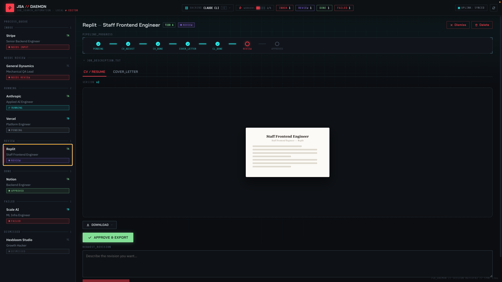
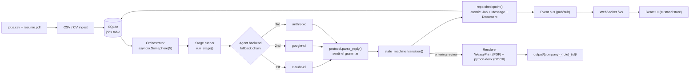
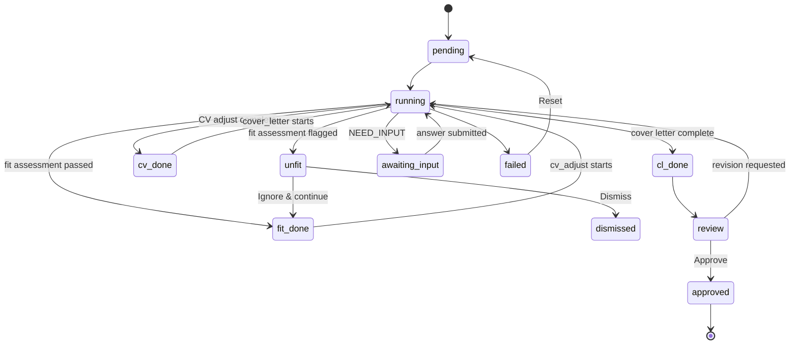
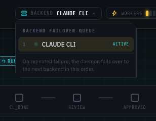
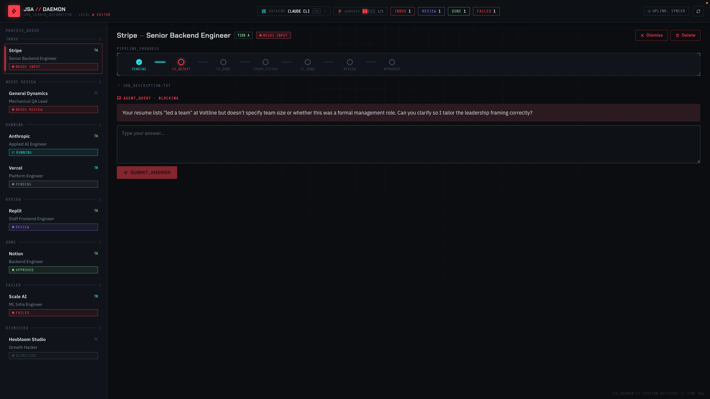
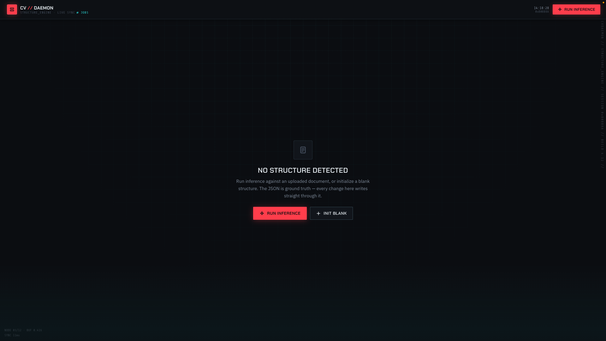
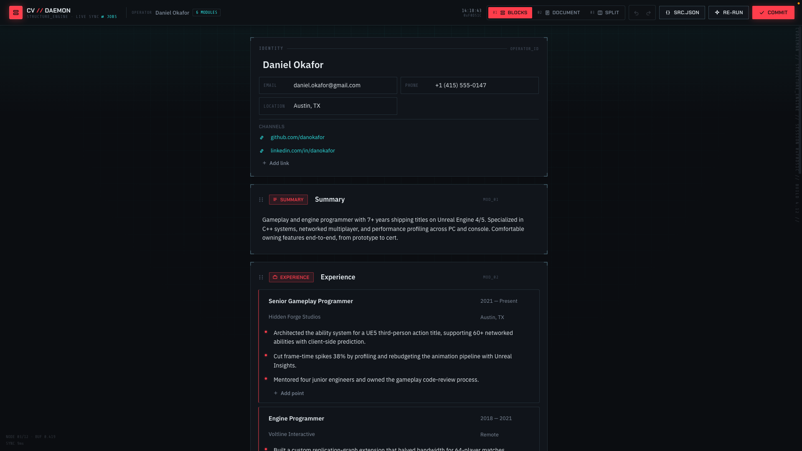
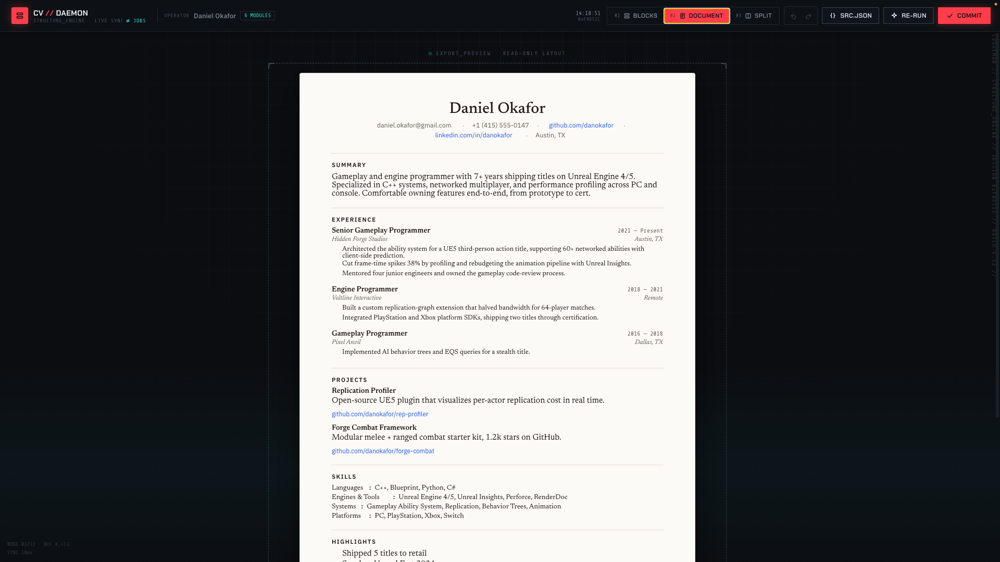
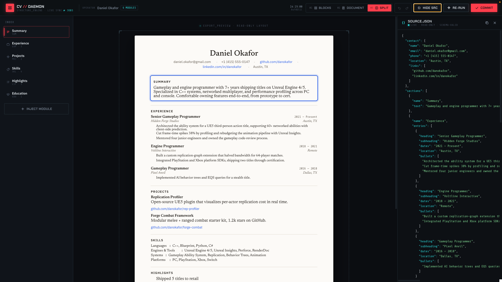

# JSA — Job Search Assistant

JSA is a CLI-launched local web application that automates tailored job-application document generation. You supply a CSV of job openings and your CV; for each row a three-stage AI pipeline (**fit assessment → CV adjustment → cover letter**) produces tailored documents that you review in a browser UI, request revisions on, and export to PDF/DOCX.

Everything runs locally — a FastAPI backend, a SQLite database, and a React/Vite frontend — driven by whichever AI backend you point it at (Claude CLI, Google `agy` CLI, or the Anthropic REST API).

<p align="center">
  
</p>

**Features:**

- Three-stage pipeline per job: fit assessment (gate) + CV tailoring + cover letter generation
- Fit-assessment gate: jobs flagged as a poor fit park in an "unfit" modal instead of burning pipeline time — dismiss the job or override and continue
- Up to 5 jobs processed concurrently with automatic semaphore control
- Follow-up Q&A: the AI asks clarifying questions; you answer them in the browser Inbox
- Full crash resilience: every stage is checkpointed; resume exactly where you left off after any crash or restart
- Revision loop: request edits on generated CV or cover letter; new document version written without re-running the whole pipeline
- Browser UI with live pipeline progress, PDF document preview, and PDF/DOCX export
- Standalone CV Structure Editor: infer a structured JSON representation of your base CV and edit it directly — this JSON is what `cv_adjust` tailors per job
- Three AI backends: Claude CLI, Google `agy` CLI, Anthropic REST API — configurable as an ordered fallback chain
- All data stored locally in SQLite (`~/.jsa/jsa.sqlite`)

---

## Table of contents

- [Architecture](#architecture)
- [Requirements](#requirements)
- [Install](#install)
- [Quick start](#quick-start)
- [CSV format](#csv-format)
- [CLI flags](#cli-flags)
- [Backends](#backends)
- [Workflow](#workflow)
- [CV Structure Editor](#cv-structure-editor)
- [Prompt customisation](#prompt-customisation)
- [Persistence and re-runs](#persistence-and-re-runs)
- [Development](#development)
- [Project structure](#project-structure)

---

## Architecture

A job moves through the pipeline as a single row in the `jobs` table, driven forward by an **orchestrator** that never blocks the event loop and always checkpoints state and output atomically.



- **Orchestrator** (`jsa/pipeline/orchestrator.py`) polls `list_runnable_jobs()` and dispatches work under an `asyncio.Semaphore(5)`, so at most 5 jobs run concurrently. Every blocking call (WeasyPrint, python-docx, pypdf, CLI subprocesses) is wrapped in `asyncio.to_thread`.
- **Stage runner** (`jsa/pipeline/stages.py`) drives one stage (`fit_assessment`, `cv_adjust`, `cover_letter`, `revising_cv`, `revising_cl`) against an `AgentBackend`, expecting a reply that ends in the sentinel grammar below.
- **Sentinel protocol** (`jsa/agents/protocol.py`) — every agent reply must terminate with exactly one of:
  ```
  <<<NEED_INPUT>>>
  <question to the user>
  <<<END>>>
  ```
  or
  ```
  <<<FINAL>>>
  <final markdown payload>
  <<<END>>>
  ```
  A missing or malformed sentinel raises `ProtocolError` and the job is marked `failed` — this is enforced, not advisory.
- **State machine** (`jsa/pipeline/state_machine.py`) is the single source of truth for legal transitions; `Job.state` and `Job.current_stage` are never set directly.
- **Checkpointing** — every state-changing write goes through `repo.checkpoint()`, a single atomic transaction that writes the new `Job` state, any `Message` rows, and any `Document` row together. This is what makes crash recovery lossless.
- **Rendering** happens once, when a job *enters* `review` (on cover-letter completion or any revision) — not on approve. `approve` only flips `review → approved`; re-export is available on demand afterward.

### Job state machine

The diagram below shows the primary happy-path route through `JobState`; `failed`/`dismissed` are reachable from nearly every state (see the full transition table in `jsa/pipeline/state_machine.py`).



### Backend fallback chain

Backends implement a common `AgentBackend` ABC (`jsa/agents/base.py`) and are tried in order via `--backends claude-cli,google-cli,anthropic` (or the equivalent `JSA_BACKENDS` env var). On a hard failure (rate limit, session expiry) the orchestrator fails over to the next backend in the chain and resumes the job from its last checkpoint — the UI surfaces which backend is currently active:

<p align="center">
  
</p>

### API surface

| Area | Routes |
|------|--------|
| Jobs | `GET /api/jobs`, `GET /api/jobs/{id}`, `POST /api/jobs/{id}/answer`, `POST /api/jobs/{id}/approve`, `POST /api/jobs/{id}/revise`, `POST /api/jobs/{id}/dismiss`, `POST /api/jobs/{id}/ignore-fit`, `POST /api/jobs/{id}/cancel`, `DELETE /api/jobs/{id}`, `POST /api/jobs/{id}/reset`, `GET /api/jobs/{id}/document/{stage}`, `POST /api/jobs/{id}/export` |
| Files | `GET /api/files/{relpath}` — serves rendered PDF/DOCX with `Content-Disposition: inline` |
| CV Structure Editor | `GET /api/cv-structure`, `PUT /api/cv-structure`, `POST /api/cv-structure/infer` |
| Meta | `GET /api/health`, `GET /api/config` |
| Realtime | `WS /ws` — pushes `status_changed`, `stage_complete`, `approved`, `log`, and `infer_progress` events to the React store |

---

## Requirements

- **Python 3.11+**
- **Node.js 18+** (only needed once to build the frontend bundle)
- **System libraries for WeasyPrint:**
  - macOS: `brew install cairo pango gdk-pixbuf libffi`
  - Linux (Debian/Ubuntu): `apt install libcairo2 libpango-1.0-0 libgdk-pixbuf2.0-0 libffi-dev`

---

## Install

```bash
# Clone the repository
git clone https://github.com/yourname/jsa.git
cd jsa

# Install the Python package (editable install includes all dependencies)
pip install -e .

# Build the frontend bundle (required once; re-run after any frontend changes)
cd frontend && npm install && npm run build && cd ..
```

---

## Quick start

```bash
jsa --csv jobs.csv --cv resume.pdf
```

This opens `http://localhost:8765` in your browser, ingests the CSV rows as jobs, and begins processing them in the background. Pipeline progress updates live in the UI.

---

## CSV format

The CSV file must have exactly these five columns (order matters):

| Column    | Description                                      |
|-----------|--------------------------------------------------|
| `company` | Company name                                     |
| `role`    | Role / job title                                 |
| `link`    | URL to the job posting                           |
| `tier`    | Priority tier: `A` (high), `B` (medium), `C` (low) |
| `JD`      | Full job description text (may be multi-line)    |

**Example:**

```csv
company,role,link,tier,JD
Acme Corp,Software Engineer,https://acme.com/jobs/1,A,"We are looking for a software engineer to join our platform team. You will work on distributed systems..."
Beta Inc,Product Manager,https://beta.io/careers/pm,B,"Seeking a PM with 3+ years experience in B2B SaaS. Responsibilities include..."
```

Multi-line job descriptions must be wrapped in double quotes (standard CSV quoting). Most spreadsheet exports handle this automatically.

---

## CLI flags

| Flag | Default | Environment variable | Description |
|------|---------|----------------------|-------------|
| `--csv` | required | — | Path to the jobs CSV file |
| `--cv` | required | — | Path to your CV (`.pdf` or `.docx`) |
| `--out` | `output/` | `JSA_OUTPUT_DIR` | Directory where rendered PDF/DOCX files are written |
| `--backend` | `claude-cli` | `JSA_BACKEND` | AI backend (single), backward-compat alias for `--backends`: `claude-cli` \| `google-cli` \| `anthropic` |
| `--backends` | `claude-cli` | `JSA_BACKENDS` | Comma-separated ordered backend fallback chain, e.g. `claude-cli,google-cli` |
| `--db` | `~/.jsa/jsa.sqlite` | `JSA_DB_PATH` | SQLite database path |
| `--port` | `8765` | `JSA_PORT` | Port for the local web server |
| `--no-browser` | false | — | Skip opening the browser automatically |

---

## Backends

### `claude-cli` (default)

Uses the `claude` CLI tool as a subprocess. Requires `claude` to be installed and authenticated.

Download and authenticate: [https://claude.ai/download](https://claude.ai/download)

```bash
jsa --csv jobs.csv --cv resume.pdf --backend claude-cli
```

### `google-cli`

Uses the `agy` (Google Antigravity) CLI tool as a subprocess. Requires `agy` to be installed and authenticated.

```bash
jsa --csv jobs.csv --cv resume.pdf --backend google-cli
```

### `anthropic`

Uses the Anthropic REST API directly. Requires the `ANTHROPIC_API_KEY` environment variable to be set.

```bash
export ANTHROPIC_API_KEY=sk-ant-...
jsa --csv jobs.csv --cv resume.pdf --backend anthropic
```

Optional environment variables for this backend:

| Variable | Default | Description |
|----------|---------|-------------|
| `JSA_MODEL` | `claude-haiku-4-5` | Model name to use (also applies to `claude-cli`) |
| `JSA_ANTHROPIC_TIMEOUT` | `180` | Per-request timeout in seconds |
| `JSA_AGENT_TIMEOUT` | `300` | Per-request timeout for CLI backends (`claude-cli`, `google-cli`) |

New backends register in `jsa/agents/registry.py` by adding an entry to `_REGISTRY`, keyed by the CLI-flag string, and subclassing `AgentBackend`.

---

## Workflow

1. **Start JSA.** Run `jsa --csv jobs.csv --cv resume.pdf`. The browser opens at `http://localhost:8765`.

2. **Pipeline runs in background.** For each job in the CSV, the AI runs up to three stages:
   - *Fit assessment* — a one-shot gate that judges whether the role is a good fit before spending pipeline time on it
   - *CV adjustment* — tailors your CV for the specific role and JD
   - *Cover letter* — writes a matching cover letter

3. **Handle an "unfit" verdict (if raised).** If the fit-assessment stage flags the job as a poor match, it parks with a reason and a centered "not a fit" modal appears instead of proceeding. Click **Dismiss** to drop the job, or **Ignore & continue** to override and resume the pipeline.

4. **Answer follow-up questions.** If the AI needs clarification (e.g., "Your resume lists 'led a team' but doesn't specify team size — can you clarify?"), the job parks in `awaiting_input` and the question appears against that job, blocking further progress until you answer:

   <p align="center">
     
   </p>

   Type your answer and submit; the job resumes automatically.

5. **Review documents.** Once both the CV and cover letter stages complete, the job moves to **Review** and both documents are rendered to PDF and DOCX automatically. Click the job in the left rail to open both documents side-by-side as PDF previews (see the hero screenshot at the top of this README).

6. **Request revisions (optional).** In the Review pane, use the revision chat box to send targeted instructions (e.g., "Make the skills section shorter"). The AI revises the specific document without re-running the whole pipeline. A new document version is written and re-rendered to PDF/DOCX.

7. **Approve.** When satisfied, click **Approve & Export**. This only transitions the job to `approved` — the PDF/DOCX files were already rendered when the job entered Review, at:
   - `{output_dir}/{company}_{role}_{job_id[:8]}/cv.{pdf,docx}`
   - `{output_dir}/{company}_{role}_{job_id[:8]}/cover_letter.{pdf,docx}`

8. **Re-export on demand (optional).** From `review` or `approved`, you can re-render either format at any time (e.g., after editing the base CV) without re-running the pipeline.

9. **Files are in `output/`** (or the path you set with `--out`). The job moves to **Done**.

---

## CV Structure Editor

Separate from the per-job pipeline, JSA maintains one canonical, job-less **base CV** as structured JSON (`CVDocument`, `jsa/schema/cv.py`) — this is the source of truth that `cv_adjust` tailors per job. You edit it at `/api/cv-structure` (`jsa/store/cv_structure.py`, `jsa/api/routes_cv_structure.py`), either by hand-building it or by running inference against an uploaded PDF/DOCX resume.

Before anything is saved, the editor shows an empty state offering to run inference or start from a blank structure:

<p align="center">
  
</p>

Once a structure exists (inferred or hand-built), three synchronized views edit the same JSON — **Blocks** (structured, modular editing), **Document** (read-only export preview), and **Split** (Blocks alongside the raw, schema-valid `src.json`, which is ground truth: every edit writes straight through it):

<table>
<tr>
<td width="33%"><p align="center"><sub>Blocks</sub></p></td>
<td width="33%"><p align="center"><sub>Document</sub></p></td>
<td width="33%"><p align="center"><sub>Split + src.json</sub></p></td>
</tr>
</table>

`PUT /api/cv-structure` validates against the `CVDocument` schema's hard gates (a contact name, at least one renderable section, and a check that the content isn't actually a cover letter) and returns `422` with a concise reason on failure. `POST /api/cv-structure/infer` runs one-shot inference against an uploaded file, broadcasting `infer_progress` events over the WebSocket as each step activates, and returns the result **unsaved** — the editor persists it via `PUT` when you click Done.

---

## Prompt customisation

The AI prompts live at:

```
jsa/prompts/PROMPT_FIT_ASSESSMENT.md  # Fit-assessment gate system prompt
jsa/prompts/PROMPT_CDADJUST.md        # CV adjustment system prompt
jsa/prompts/CVL_PROMPT.md             # Cover letter system prompt
```

Edit these files in any text editor. Changes take effect immediately on the next job run (prompts are read from disk on every invocation, never cached).

**MANDATORY: sentinel format.** Every prompt MUST instruct the model to terminate every reply with exactly one of these two blocks:

```
<<<NEED_INPUT>>>
<question to the user>
<<<END>>>
```

or

```
<<<FINAL>>>
<final markdown payload>
<<<END>>>
```

**Do not remove or modify the sentinel instructions in the prompts.** The pipeline parser (`jsa/agents/protocol.py`) will raise a `ProtocolError` and mark the job `failed` if the sentinel is absent or malformed. The sentinel instructions are already present in the default prompt stubs.

**Fit-assessment prompt is a special case.** It must always reply with `<<<FINAL>>>` (never `<<<NEED_INPUT>>>`), and the first line of the payload must be exactly `FIT` or `UNFIT` — anything else (including an unparseable verdict) is treated as `UNFIT` and parks the job behind the "not a fit" modal rather than silently continuing.

---

## Persistence and re-runs

**Database location:** `~/.jsa/jsa.sqlite` (configurable via `--db`).

**Job identity:** `sha1(f"{company}|{role}|{link}")[:16]`. **JD hash:** `sha1(jd)[:16]`.

**Re-running with the same CSV** resumes from the last checkpoint — no work is repeated:

- Jobs in `approved` state with unchanged JD are skipped entirely.
- Jobs in `failed` state are reset to `pending` and restarted.
- Jobs in `running`, `fit_done`, `cv_done`, `cl_done`, `awaiting_input`, or `review` resume from where they left off.
- Jobs in `unfit` stay parked behind the modal until you dismiss or override them.
- If a job's JD has changed since the last run, it is reset to `pending` and re-processed.

**Crash recovery:** on every startup JSA runs a recovery sweep. Any job stuck in `running` (which indicates it was mid-stage when the process died) is reverted to the last completed stage:
- Has a cover letter document → `cl_done` (cover letter stage will be re-run)
- Has a CV document → `cv_done` (cover letter stage will run next)
- Has neither → `pending` (fit assessment re-runs from scratch)

Jobs in `awaiting_input`, `review`, `approved`, or `failed` are left untouched by the sweep — for `awaiting_input`, the question is already in the database.

**Reset a failed job:** click the **Reset** button in the job's detail pane in the UI. This transitions the job back to `pending` so it will be re-processed on the next wakeup.

---

## Development

### Backend tests

```bash
pytest -v
```

Skip integration tests (which call real APIs or require full end-to-end setup):

```bash
pytest -v -m "not integration"
```

Run only integration tests:

```bash
pytest tests/backend/test_integration.py -v -m integration
```

Backend tests use **fakes over mocks** — `tests/backend/fakes/fake_backend.py` (`FakeAgentBackend`) drives all pipeline and orchestrator tests instead of patching internals.

### Frontend tests

```bash
cd frontend && npm test
```

### Frontend dev server (hot reload)

```bash
# In one terminal: start the JSA backend
jsa --csv jobs.csv --cv resume.pdf --no-browser

# In another terminal: start the Vite dev server
cd frontend && npm run dev
# Open http://localhost:5173
```

The Vite dev server proxies API calls to `http://localhost:8765` automatically.

---

## Project structure

```
jsa/                   Python package
  cli.py               Entry point (typer)
  config.py             Settings (pydantic-settings)
  server.py             FastAPI app factory
  db/                    SQLAlchemy models (Job, Message, Document, FollowUp, RevisionRequest), engine, repository
  ingest/                CSV and CV loaders
  agents/                AgentBackend ABC, three backends (claude_cli, google_cli, anthropic_api), registry, sentinel protocol parser
  prompts/               Prompt files (edit these) + loader (no caching)
  pipeline/              Orchestrator, stage runners (stages.py), state machine, CV structure inference
  render/                PDF (WeasyPrint) and DOCX (python-docx) renderers
  events/                In-process pub/sub bus + WS event schema
  api/                   FastAPI route handlers (jobs, cv-structure, meta, websocket)
  schema/                Structured CV/cover-letter Pydantic schemas
  store/                 CV Structure Editor persistence (canonical base-CV JSON)
  dev/                   Dev-only helpers (auto-answer NEED_INPUT gates)
frontend/               React + Vite + TypeScript UI
  src/components/        JobList, JobDetail, ReviewPane, ChatBox, FollowUpPane, UnfitModal, StageTimeline, StatusBadge
  src/components/cv-editor/  CvEditor (Blocks / Document / Split views), PaperSheet, JsonDrawer
  src/store.ts            Zustand store for job list/detail state
  src/editorStore.ts       Zustand store for the CV Structure Editor
  src/ws.ts                WebSocket client wiring live events into the stores
tests/                  pytest (backend) + vitest (frontend)
```
